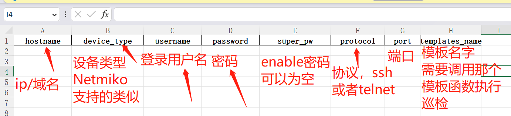
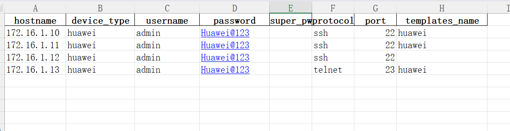
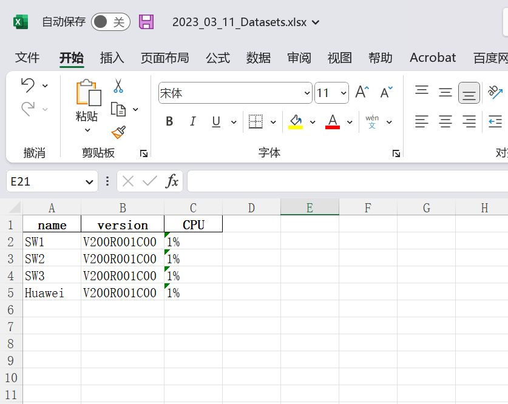
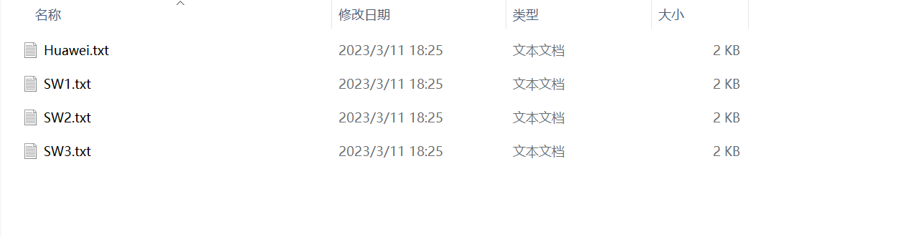

# 简单网络巡检工具

## 概括

该应用实现对交付工程师在交付交付中无相应网管设备，或者中小型网络运维无网管设备，需要对交换机设备做批量的信息收集而开发的一个可扩展性的网络设备信息收集工具。

工具特点：可以很便捷的扩展需要的功能，不需要去关注怎么连接设备问题，怎么处理数据问题，只需要在模板中添加对应模板，跟对应的收集数据函数就可以完成功能的扩展，可以适用于更多场景。

本项目做为开源项目，欢迎各位大拿多多出注意，有能力的可以一起对项目进行维护和修复BUG，一起成为开源社区中的一个贡献者。

### 前端界面

前端源码链接：https://github.com/liuyuanchengweb/simple_network_inspection_tool_vue3


### 后端接口

还有三个Websocket接口没有显示

API/ws/start 启动设备巡检接口

API/ws/BackupConfig 配置备份文件接口

API/ws/ConnectTest 测试连通性接口


### 目录结构

```html
│  index.html  #前端静态文件
│  LICENSE
│  poetry.lock  #依赖管理
│  pyproject.toml  #依赖管理
│  README.md
│  requirements.txt  #依赖管理
│  run.py  #项目入口文件
│  vite.svg
│  
├─API
│      crud.py  #ORM查询语句
│      database.py  #数据库连接模块
│      decorator.py  #模块引用装饰器
│      file_handle.py  #文件数据处理类
│      huawei_telnet.py  #netmiko4.1.2在登录华为telnet时BUG，重写huawei telnel类
│      main.py #接口文件
│      models.py  #创建数据库表
│      schemas.py  #数据模型类
│      utility.py  #工具连接类
│      __init__.py
│      
├─static  #静态资源
│  │  404-10831104.css
│  │  404-ffe76c04.js
│  │  index-559a7015.js
│  │  index-559a7015.js.gz
│  │  index-653f5afe.js
│  │  index-653f5afe.js.gz
│  │  index-a17e779c.css
│  │  index-a17e779c.css.gz
│  │  index-ede6bcd3.css
│  │  index-ede6bcd3.css.gz
│  │  
│  └─image
│          image-20230311173710167.png
│          image-20230311175830892.png
│          image-20230311182225788.png
│          image-20230311182347849.png
│          image-20230311182505326.png
│          image-20230311182548191.png
│          image-20230311183240998.png
│          image-20230311184148620.png
│          image-20230311184946946.png
│          image-20230311185329838.png
│          image-20230311185357072.png
│          
└─templates  #可扩展模板，名字可自定义
        Cisco.py
        h3c.py
        huawei.py
        __init__.py
        
```
## 应用部署

### 环境

Python 3.10以上

部署测试虚拟机为Windows10


### 部署命令

~~~sh
# 查看自己环境的python版本
C:\Users\ycll>python -v
# 3.10以上
# 更新pip
C:\Users\ycll>python.exe -m pip install --upgrade pip
# 安装pipx
C:\Users\ycll>python -m pip install --user pipx -i https://pypi.tuna.tsinghua.edu.cn/simple
# pipx刷新到系统变量中
C:\Users\ycll>python -m pipx ensurepath
# 确认pipx安装是否正常
C:\Users\ycll>pipx --version
1.1.0
# 安装poetry会稍微有点慢
C:\Users\ycll>pipx install poetry -i https://pypi.tuna.tsinghua.edu.cn/simple
# 安装好确认安装正常
C:\Users\ycll>poetry -V
Poetry (version 1.4.0)
# 进入项目目录
C:\Users\ycll>cd C:\Users\ycll\Desktop\simple_network_inspection_tool_v0.2.0
# 安装依赖
C:\Users\ycll\Desktop\simple_network_inspection_tool_v0.2.0>poetry install
# 运行项目
poetry run run.py
~~~


默认监控18888端口

运行后访问127.0.0.1:18888为前端页面

接口文档地址为127.0.0.1:18888/docs

可以通过本地访问，也可以通过远端访问


## 应用说明

### 工具架构

该工具使用FastAPI做为后端框架，前端使用的VUE3进行开发的完全前后端分离项目。

### 设备驱动

设备类型驱动均为netmiko驱动，设备类型必须填写netmiko驱动列表中的设备，后端有校验，在录入设备时，会对设备类型字段和协议字段进行校验，为枚举类型。

### 可扩展性

对于需要定义的收集信息，可以按照一定规范编写函数，返回内容即可完成相关信息的扩展。

例如该华为模板

固定写法------>导入DataHandle类装饰器，导入netmiko中的BaseConnection做为类型注解，可以在编写时便捷，需要执行巡检的函数添加到all方法中，备份配置文件函数需要写固定函数名。

导入完成后实例化DataHandle类装饰器，目前DataHandle类装饰器实现了两个方法装饰器

backup_config做为保存成txt配置文件的装饰器，需要固定返回数据和文件名  return 数据,文件名 --->数据做为写入到文件中的内容，文件名作为保存的文件名。

data做为一个收集信息保存到excel的装饰器，在开发模板函数时，只需要使用该装饰器，并且固定返回两个值，data和table即可，data做为excel表数据，table做为列名

~~~python
import re
from API.decorator import DataHandle
from netmiko import BaseConnection
data = DataHandle()
# 例如这个，在启动设备巡检时会自动执行__all__列表中的函数
__all__ = ['huawei_name', 'huawei_version', 'huawei_cpu']

# 备份配置文件的函数需要写固定函数名
# 以下例子，调用backup_config装饰器，函数名固定为backup_config（conn）：
# 备份配置文件函数需要固定名称和固定参数。
@data.backup_config
def backup_config(conn: BaseConnection):
    output = conn.send_command(command_string='display current-configuration')
    file_names = re.search(r'sysname\s(.*)', output).group(1)
    file_name = f'{file_names}.txt'
    data = output
    return data, file_name

# 常规采集数据写法，调用data装饰器，函数固定参数conn，固定返回两个值，其余自由编写
@data.data
def huawei_cpu(conn: BaseConnection):
    table = 'CPU'
    output = conn.send_command(command_string='display cpu-usage')
    data = re.search(r'CPU Usage\s+:\s([0-9]{1,3}%)', output).group(1)
    return data, table
~~~


## 功能

### 下载导入模板

该功能主要实现对需要批量添加的设备生成一个excel文档，用来填写相应信息。



### 批量导入模板

该功能主要实现对填写好的excel导入到数据库中，用来进行对设备操作，填写举例



### 新增设备

该功能主要用于方便快捷的添加单台设备，直接通过页面来可视化添加设备


### 测试连接

主要用于测试设备的端口是否连通正常


### 启动巡检

主要用于启动设备连接，执行插件模板中的函数，执行完成根据插件模板中的函数返回的内容形成excel文档.


生成文件，可以根据自身需求，做改变或者扩展，生成更多内容，和支持更多设备。



### 备份配置文件

主要用于收集设备的配置文件，默认以txt格式文件存储.


备份配置文件完成会生成txt文件



### 查询接口

在多台设备中查找出一台显示

### 编辑接口

主要用于修改设备信息

### 删除接口

删除数据库中的设备


## 感谢
前端室友
NetDevOps同路人：王印老师，九净老师，点滴技术，朱嘉盛老师

以及Netmiko开源项目，FastAPI,以及相关的开源项目
## 开源许可
开源许可遵循MIT开源协议
