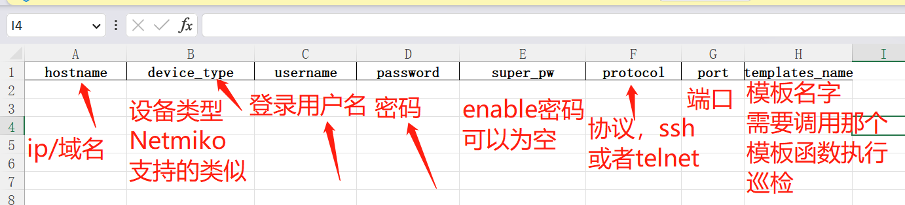
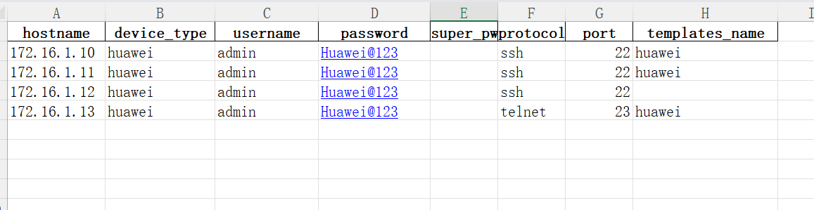
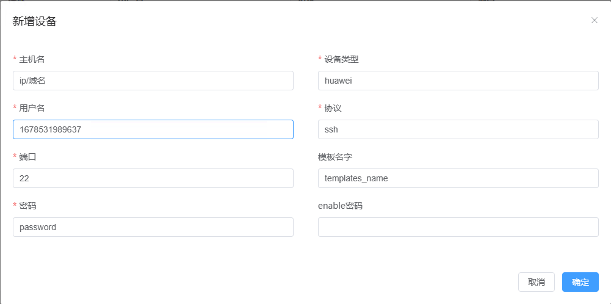
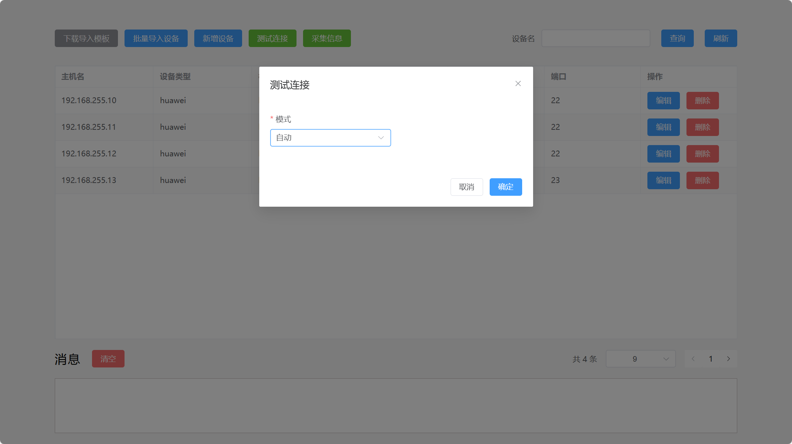
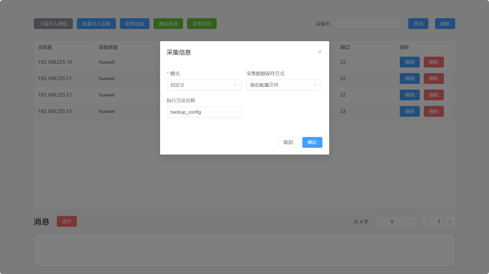

## 功能介绍

### 下载导入模板

该功能主要实现对需要批量添加的设备生成一个excel文档，用来填写相应信息。

### 批量导入模板

该功能主要实现对填写好的excel导入到数据库中，用来进行对设备操作，填写举例

### 新增设备

该功能主要用于方便快捷的添加单台设备，直接通过页面来可视化添加设备

### 测试连接

主要用于测试设备的端口是否连通正常

### 数据采集

通过前端下发指令，执行模板中的数据采集方法

生成文件，可以根据自身需求，做改变或者扩展，生成更多内容，和支持更多设备。

### 查询接口

在多台设备中查找出一台显示

### 编辑接口

主要用于修改设备信息

### 删除接口

删除数据库中的设备