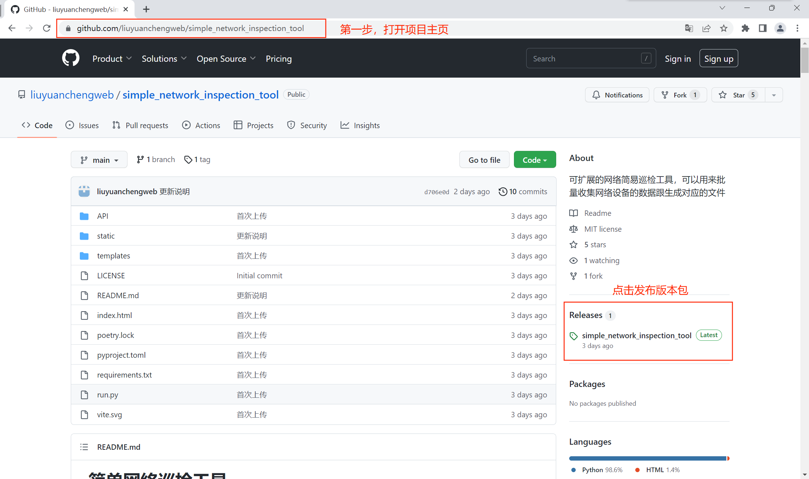
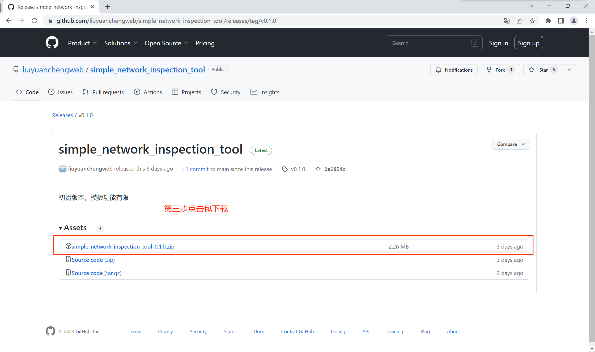
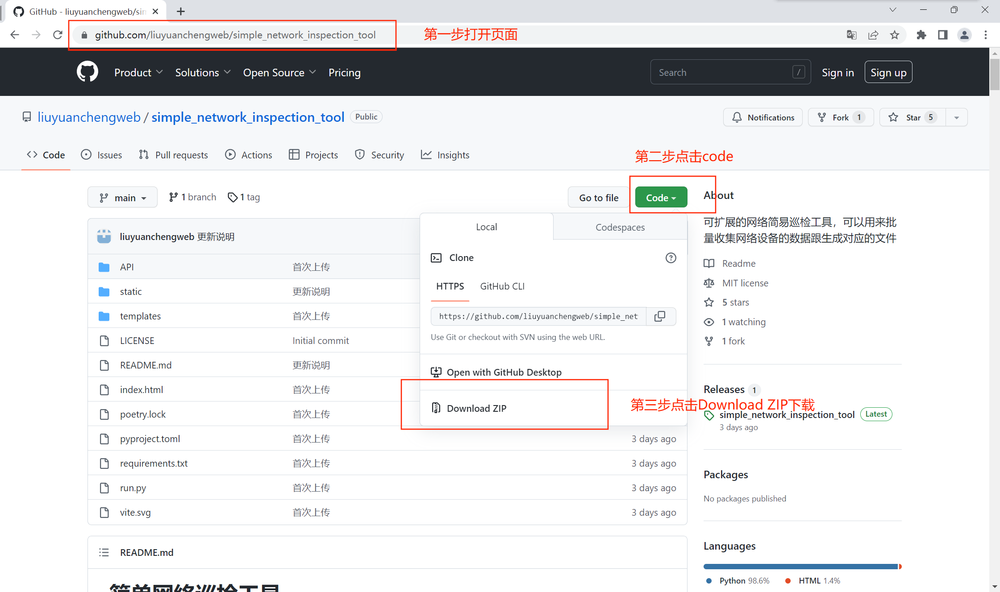
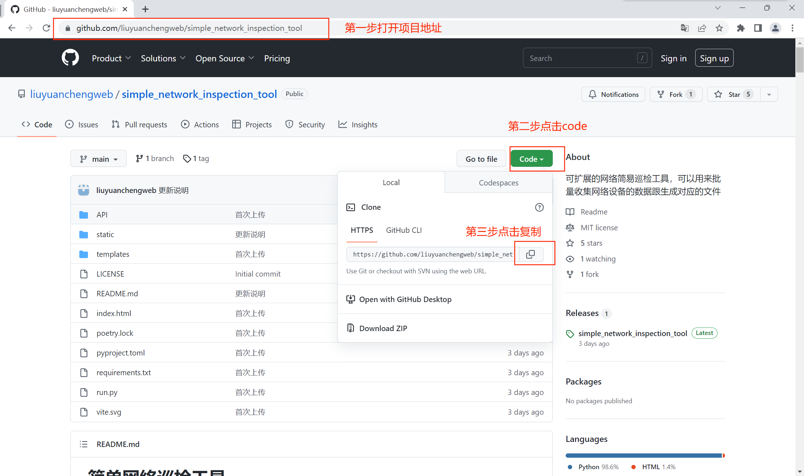
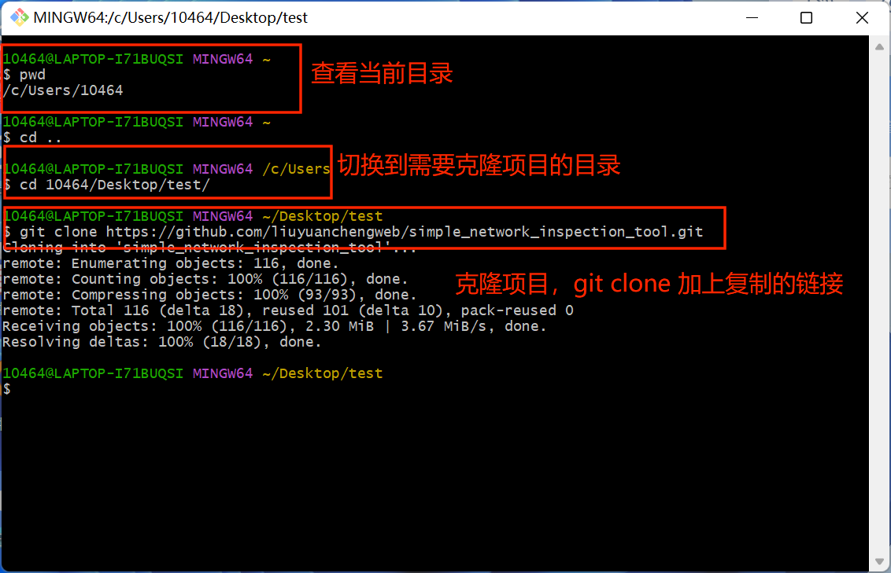

# 简单网络巡检工具部署&poetry依赖管理工具使用拓展

## Python版本

python 3.10以上

## 怎么从GitHub或则gitee获取开源项目

截图以Github的，在操作的时候GitHub和Gitee都是一样的没有什么区别

### 1、通过下载发布版本包

### 2、代码下载方式

### 3、git工具下载

## 一、为什么需要包管理

python应用的开发会借助一些第三方的包进行开发，而当开发的项目需要在其他地方运行时就必须要安装相应的依赖包，那么怎么确保方便的可以使得开发的应用在不同的环境下都能正常运行呢？这就需要用到python的包管理，在这里主要讲到了两种：一种是比较方便的创建虚拟环境，使用普通的pip安装依赖模式。另外一种是使用poetry工具的安装模式。

## 二、虚拟环境的安装方式

推荐使用poetry方式安装依赖

虚拟环境的原理此处不在过多描述

操作方式打开cmd,最好使用管理员打开CMD，尽量不要使用其他shell，以免出现奇怪问题

~~~shell
# 进入到目录，查看文件，使用dir命令，确认文件夹下存在requirements.txt文件，以及项目的其他文件
dir
# 安装虚拟环境，执行命令完成后会在文件夹内生产一个venv的文件夹，如果没有生成查找venv相关文档查看
python -m venv venv
# 激活虚拟环境，该命令的意思执行venv文件夹下Scripts文件下的activate文件，激活虚拟环境后目录前方会被括号括住
venv\Scripts\activate
# 激活虚拟环境后的状态
# (venv) C:\Users\10464\Desktop\test\simple_network_inspection_tool>
# 更新pip库，在虚拟环境下执行
python -m pip install --upgrade pip
# 执行依赖安装，在虚拟环境下执行国内会存在下载比较慢的情况，可以在后面加 -i 国内源
pip install -r requirements.txt
# 安装完成后即可运行，在运行文件的时候存在两种情况，一种是py文件的默认打开方式为python解释器，可以直接在虚拟环境下运行
run.py
# 另外一种是.py文件的默认打开方式为编辑器时，需要使用python解释器执行
venv\Scripts\python.exe run.py
#
~~~

## Poetry方式安装

poetry是什么呢？

Poetry 是 Python 中用于**依赖管理和打包**的工具。 它允许您声明项目所依赖的库，并将为您管理（安装/更新）它们。 Poetry 提供了一个锁文件来确保可重复安装，并且可以构建您的项目以进行分发。

在安装poetry之前需要安装pipx，因为这是poetry推荐的安装方式

~~~shell
# 安装pipx
python -m pip install --user pipx -i https://pypi.tuna.tsinghua.edu.cn/simple
# pipx刷新到系统变量中
python -m pipx ensurepath
~~~

打开新的界面使用pipx安装poetry

~~~shell
# 安装poetry
pipx install poetry -i https://pypi.tuna.tsinghua.edu.cn/simple
# 确认poetry是否正常安装以及版本是否小于1.4.0
poetry -V
~~~

在项目的目录下运行poetry安装依赖并且运行项目

~~~shell
# 安装依赖
poetry install
# 安装完依赖后运行程序，如果.py文件默认是python解释器打开方式，直接使用以下方式
poetry run run.py
# 如果.py文件默认打卡方式是其他的方式
poetry shell
poetry run python run.py
~~~

## poetry知识拓展

为什么使用poetry？

在poetry中存在着一个`poetry.lock`文件，这个文件可以记录依赖的hash值，当项目在其他地方进行安装时，在安装包时会校验包的hash是否一致来确认依赖的相同性，用来保证应用的正常运行。

### poetry基础使用

创建项目

~~~shell
# 项目名poetry-demo
poetry new poetry-demo
~~~

创建后会生成一个项目目录

~~~
poetry-demo
├── pyproject.toml
├── README.md
├── poetry_demo
│   └── __init__.py
└── tests
    └── __init__.py
~~~

pyproject.toml文件是最重要的，记录着包的依赖关系

~~~
[tool.poetry]
name = "poetry-demo"
version = "0.1.0"
description = ""
authors = ["Sébastien Eustace <sebastien@eustace.io>"]
readme = "README.md"
packages = [{include = "poetry_demo"}]

[tool.poetry.dependencies]
python = "^3.7"

[build-system]
requires = ["poetry-core"]
build-backend = "poetry.core.masonry.api"
~~~

其中比较重要的就是[tool.poetry.dependencies]下面的内容，主要是依赖的控制，此处的意思为python的版本要大于3.7

初始化一个已有的项目

~~~
cd pre-existing-project
poetry init
~~~

使用poetry安装包并且添加到pyproject.toml文件

~~~python
poetry add netmiko
~~~

虚拟环境

默认情况下，poetry会创建虚拟环境

~~~shell
# 执行poetry env info可以查看虚拟环境的信息
C:\Users\10464\Desktop\test\htest>poetry env info
Virtualenv
Python:         3.10.2
Implementation: CPython
Path:           C:\Users\10464\Desktop\test\htest\.venv
Executable:     C:\Users\10464\Desktop\test\htest\.venv\Scripts\python.exe
Valid:          True

System
Platform:   win32
OS:         nt
Python:     3.10.2
Path:       D:\compiler\Python310
Executable: D:\compiler\Python310\python.exe

~~~

为什么需要激活虚拟环境？

子进程从父进程继承它们的环境，但不共享它们。因此，子进程所做的任何修改在子进程退出后都不会被持久化。Python应用程序(Poetry)作为子进程，不能修改调用它的shell环境，从而使激活的虚拟环境在Poetry命令执行完成后仍保持激活状态。

因此，Poetry必须创建一个激活虚拟环境的子shell，以便从虚拟环境中运行后续命令。

~~~shell
# 激活虚拟环境
poetry shell
~~~

安装依赖

~~~
poetry install
~~~

运行脚本

~~~
poetry run  脚本名字
~~~

### poetry的配置

列出当前配置

要列出当前配置，您可以使用该选项 的命令：`--list``config`

~~~
poetry config --list
~~~

返回相关内容

~~~shell
cache-dir = "poetry使用的缓存目录路径"
# 设置多任务并行安装程序
installer.max-workers = null
# 如果尚不存在虚拟环境,创建一个新的虚拟环境，如果virtualenvs.in-project为false，则虚拟环境目录为virtualenvs.path路径下
virtualenvs.create = true
# 在项目的根目录中创建虚拟环境,建议设置为true，方便找到虚拟环境
virtualenvs.in-project = true
virtualenvs.path = "{cache-dir}\\virtualenvs"  # C:\Users\10464\AppData\Local\pypoetry\Cache\virtualenvs
~~~

修改配置信息

~~~shell
# 修改全局配置
poetry config virtualenvs.create false
# 修改当前项目配置
poetry config virtualenvs.create false --local
# 重置配置
poetry config virtualenvs.create --unset
~~~

