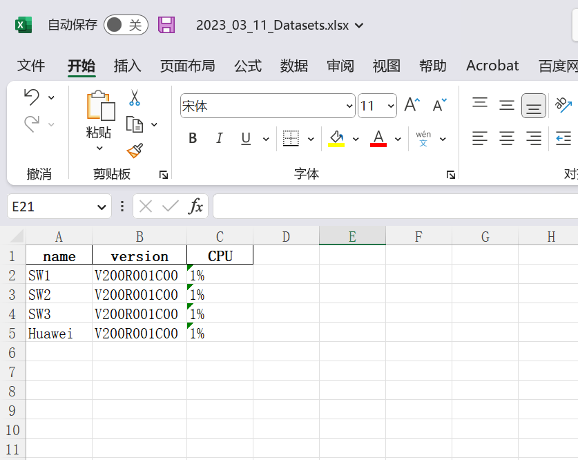
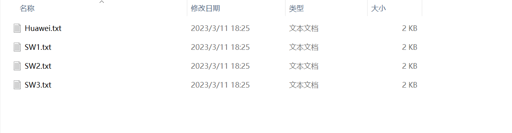

# 简单网络巡检工具

## 应用介绍


### 后端接口

还有三个Websocket接口没有显示

API/ws/start 启动设备巡检接口

API/ws/BackupConfig 配置备份文件接口

API/ws/ConnectTest 测试连通性接口


### 目录结构

```html
│  index.html  #前端静态文件
│  LICENSE
│  poetry.lock  #依赖管理
│  pyproject.toml  #依赖管理
│  README.md
│  requirements.txt  #依赖管理
│  run.py  #项目入口文件
│  vite.svg
│  
├─API
│      crud.py  #ORM查询语句
│      database.py  #数据库连接模块
│      decorator.py  #模块引用装饰器
│      file_handle.py  #文件数据处理类
│      huawei_telnet.py  #netmiko4.1.2在登录华为telnet时BUG，重写huawei telnel类
│      main.py #接口文件
│      models.py  #创建数据库表
│      schemas.py  #数据模型类
│      utility.py  #工具连接类
│      __init__.py
│      
├─static  #静态资源
│  │  404-10831104.css
│  │  404-ffe76c04.js
│  │  index-559a7015.js
│  │  index-559a7015.js.gz
│  │  index-653f5afe.js
│  │  index-653f5afe.js.gz
│  │  index-a17e779c.css
│  │  index-a17e779c.css.gz
│  │  index-ede6bcd3.css
│  │  index-ede6bcd3.css.gz
│  │  
│  └─image
│          image-20230311173710167.png
│          image-20230311175830892.png
│          image-20230311182225788.png
│          image-20230311182347849.png
│          image-20230311182505326.png
│          image-20230311182548191.png
│          image-20230311183240998.png
│          image-20230311184148620.png
│          image-20230311184946946.png
│          image-20230311185329838.png
│          image-20230311185357072.png
│          
└─templates  #可扩展模板，名字可自定义
        Cisco.py
        h3c.py
        huawei.py
        __init__.py
        
```

## 应用说明

### 工具架构

该工具使用FastAPI做为后端框架，前端使用的VUE3进行开发的完全前后端分离项目。

### 设备驱动

设备类型驱动均为netmiko驱动，设备类型必须填写netmiko驱动列表中的设备，后端有校验，在录入设备时，会对设备类型字段和协议字段进行校验，为枚举类型。

### 可扩展性

对于需要定义的收集信息，可以按照一定规范编写函数，返回内容即可完成相关信息的扩展。

例如该华为模板

固定写法------>导入DataHandle类装饰器，导入netmiko中的BaseConnection做为类型注解，可以在编写时便捷，需要执行巡检的函数添加到all方法中，备份配置文件函数需要写固定函数名。

导入完成后实例化DataHandle类装饰器，目前DataHandle类装饰器实现了两个方法装饰器

backup_config做为保存成txt配置文件的装饰器，需要固定返回数据和文件名  return 数据,文件名 --->数据做为写入到文件中的内容，文件名作为保存的文件名。

data做为一个收集信息保存到excel的装饰器，在开发模板函数时，只需要使用该装饰器，并且固定返回两个值，data和table即可，data做为excel表数据，table做为列名

~~~python
import re
from API.decorator import DataHandle
from netmiko import BaseConnection
data = DataHandle()
# 例如这个，在启动设备巡检时会自动执行__all__列表中的函数
__all__ = ['huawei_name', 'huawei_version', 'huawei_cpu']

# 备份配置文件的函数需要写固定函数名
# 以下例子，调用backup_config装饰器，函数名固定为backup_config（conn）：
# 备份配置文件函数需要固定名称和固定参数。
@data.backup_config
def backup_config(conn: BaseConnection):
    output = conn.send_command(command_string='display current-configuration')
    file_names = re.search(r'sysname\s(.*)', output).group(1)
    file_name = f'{file_names}.txt'
    data = output
    return data, file_name

# 常规采集数据写法，调用data装饰器，函数固定参数conn，固定返回两个值，其余自由编写
@data.data
def huawei_cpu(conn: BaseConnection):
    table = 'CPU'
    output = conn.send_command(command_string='display cpu-usage')
    data = re.search(r'CPU Usage\s+:\s([0-9]{1,3}%)', output).group(1)
    return data, table
~~~


## 功能

### 下载导入模板

该功能主要实现对需要批量添加的设备生成一个excel文档，用来填写相应信息。


### 批量导入模板

该功能主要实现对填写好的excel导入到数据库中，用来进行对设备操作，填写举例


### 新增设备

该功能主要用于方便快捷的添加单台设备，直接通过页面来可视化添加设备


### 测试连接

主要用于测试设备的端口是否连通正常


### 启动巡检

主要用于启动设备连接，执行插件模板中的函数，执行完成根据插件模板中的函数返回的内容形成excel文档.


生成文件，可以根据自身需求，做改变或者扩展，生成更多内容，和支持更多设备。



### 备份配置文件

主要用于收集设备的配置文件，默认以txt格式文件存储.


备份配置文件完成会生成txt文件



### 查询接口

在多台设备中查找出一台显示

### 编辑接口

主要用于修改设备信息

### 删除接口

删除数据库中的设备

## 开源许可
开源许可遵循MIT开源协议