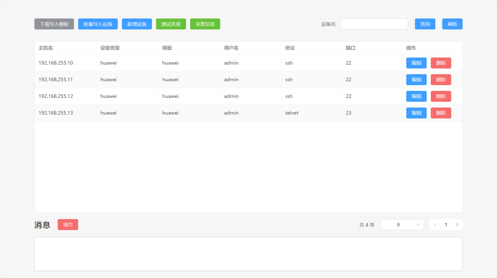
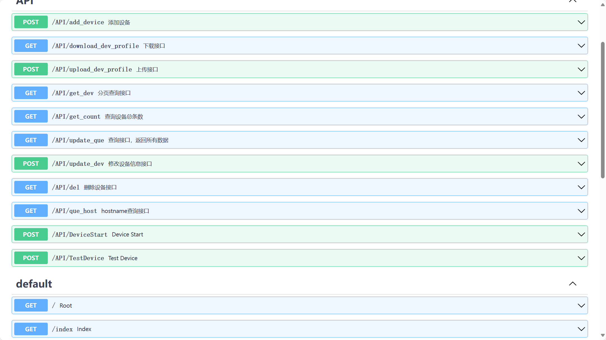

# 简单网络巡检工具
开源地址：

GitHub：https://github.com/liuyuanchengweb/simple_network_inspection_tool

Gitee：https://gitee.com/useryc/simple

## 应用介绍

### 后端接口

127.0.0.1:18888 http接口

127.0.0.1:18887 websocket接口

接口文档地址:http://127.0.0.1:18888/docs#/

## 应用说明

### 工具架构

该工具使用FastAPI做为后端框架，前端使用的VUE3进行开发的完全前后端分离项目。

### 设备驱动

设备类型驱动均为netmiko驱动，设备类型必须填写netmiko驱动列表中的设备，后端有校验，在录入设备时，会对设备类型字段和协议字段进行校验，为枚举类型。

### 可扩展性

多种采集信息处理方式，提供基础接口

[扩展性演示](简化模板函数编写.md)

### 应用部署
Python 3.10以上

## 开源许可
开源许可遵循MIT开源协议