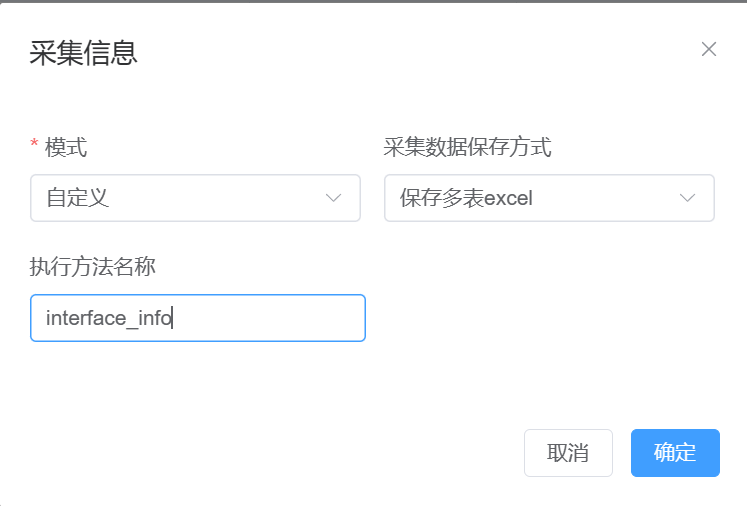

# 简化模板函数编写

模板函数做为业务逻辑密切相关的方法，通过方法的包装，使得可以只关注于业务逻辑的编写，不去关注其他的逻辑。

模板函数目前暂时分为5类

## 备份配置文件

### 函数编写：

```python
from netmiko import BaseConnection
from API.logger import logger

def backup_config(conn: BaseConnection):
    output = conn.send_command_timing(command_string='display curr')
    file_names = re.search(r'sysname\s(.*)', output).group(1)
    file_name = f'{file_names}.txt'
    logger.info(f'执行完成backup_config函数---->文件名{file_name}')
    return {'content': output, 'file_name': file_name}

#方法名称固定为backup_config
# 函数固定有一个参数conn,该参数类型为BaseConnection
# logger内容可以输出到前端
# 返回内容为字典，必须包含两个key  {'content':”内容“，’file_name‘:'文件名'}
```

### 前端操作：


### 采集结果：


## 保存文本格式

### 函数编写：

```python
#导包同上
def save_text(conn: BaseConnection):
    output = conn.send_command_timing(command_string='display curr')
    file_path = 'D:\home\py\simple_network_inspection_tool_0.1.1\datasets'
    file_name = 'save_text.txt'
    return {'content': output, 'file_path': file_path, 'file_name': file_name}
#该场景主要是将所有设备采集到的信息都保存到一个文件中
# 固定返回内容格式
# return {'content': output, 'file_path': file_path, 'file_name': file_name}
# content：内容
# file_path：文件路径
# file_name：文件名
```

### 前端操作：


### 采集结果：


## 保存内容单表excel

### 函数编写：

```python
import re
from netmiko import BaseConnection
from API.logger import logger

__all__ = ['huawei_name', 'huawei_version', 'huawei_cpu']

def huawei_cpu(conn: BaseConnection):
    output = conn.send_command(command_string='display cpu-usage')
    datas = re.search(r'CPU Usage\s+:\s([0-9]{1,3}%)', output).group(1)
    return {'content': {'CPU': datas}}


def huawei_name(conn: BaseConnection):
    output = conn.send_command(command_string='display current-configuration | include sysname')
    datas = re.search(r'sysname\s(.*)', output).group(1)
    return {'content': {'name': datas}}


def huawei_version(conn: BaseConnection):
    output = conn.send_command(command_string='display version')
    datas = re.search(r'VRP \(R\) software, Version\s\S+\s\(\S+\s(V[0-9]+R[0-9]+C[0-9]+)\)', output).group(1)
    return {'content': {'version': datas}}

# 跟上述不同点，需要添加__all__列表，返回内容格式为  {'content':dict}
# {'CPU': datas}  key=excel的列名，value=excel这列中的值
```

### 前端操作：


### 采集结果：


## 保存多表excel

### 函数编写：

~~~python
from netmiko import BaseConnection
from API.templates_interface import InterfaceEntry
from API.logger import logger
interface_entry = InterfaceEntry()

def interface_info(conn: BaseConnection):
    output = conn.send_command_timing(command_string='display interface brief')
    fsm_obj = interface_entry.get_fsm_object(output, 'interface_info.textfsm')
    data = fsm_obj.get_parsed_data_as_json()
    file_name = 'sw_interface_info.xlsx'
    sheet = conn.host
    return {'content': data, 'file_name': file_name, 'sheet_name': sheet}
# 该方法借助了InterfaceEntry对象，使用TextFSM,采集了接口信息
# 返回数据格式
# content: 列表或者字典，可以直接存入到excel的数据。
# file_name：文件名字
# sheet_name：工作表名字
~~~

### 前端操作：



### 采集结果：


## 自定义保存格式

自定义保存格式，可以不返回数据，演示为保存数据到数据库

### 函数编写：

1、先创建一个表

新建一个模块，编写创建表的函数，编写完成后直接执行

```python
from API.templates_interface import InterfaceEntry
interface_entry = InterfaceEntry()
def create_table():
    table_name = "interface_table1-1"
    fields = {
        "time": "DateTime",
        "ip_add": "string",
        "content": "string",
    }
    interface_entry.create_table(table_name=table_name, fields=fields)


create_table()
# 通过interface_entry中的create_table方法动态的创建表，传入表名和字段，字段以字典方式传，key为字段，value为数据类型。
```

2、在模板内编写

```python
from netmiko import BaseConnection
from API.templates_interface import InterfaceEntry
from datetime import datetime
from API.logger import logger

interface_entry = InterfaceEntry()

def save_database_interface_info(conn: BaseConnection):
    output = conn.send_command_timing(command_string='display interface brief')
    fsm_obj = interface_entry.get_fsm_object(output, 'interface_info.textfsm')
    data = fsm_obj.get_parsed_data_as_json()
    sheet = conn.host
    interface_entry.database_insert_data(table_name='interface_table1-1', data_dict={
        "time": datetime.now(),
        "ip_add": sheet,
        "content": data,
    })
 
# 主要是通过调用interface_entry.database_insert_data()方法实现的
# 向该方法内传入要插入数据的表名和字段，字段必须跟创建表的一样
```


### 前端操作：


### 采集结果：

